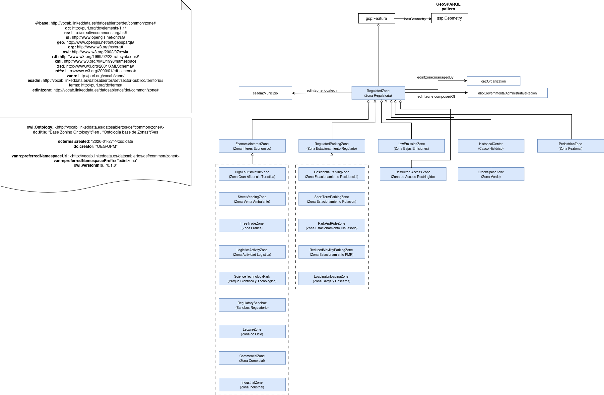

# Ontología para la representación de Zonas Regulatorias (Regulated Zone Ontology)

Esta ontología tiene como propósito definir, categorizar y relacionar las Zonas Regulatorias en el contexto de la movilidad inteligente y la gestión urbana (Smart Cities). Se ha diseñado como una extensión modular de la ontología del Sector Público de España (esadm).

# Propósito y alcance de la ontología (Purpose and scope of the ontology)

Actualmente, existen vocabularios para divisiones administrativas (esadm) y geometrías (GeoSPARQL), pero existía un vacío semántico para representar entidades funcionales que se superponen a la trama urbana (ZBE, Carga y Descarga, etc...) sin responder a límites administrativos fijos. Esta ontología cubre dicho hueco.

# Prefijo y espacio de nombres (Prefix and namespace)

El prefijo de la ontología *Zonas Regulatorias* es: `edintzone` publicado bajo el espacio de nombres: [http://vocab.linkeddata.es/datosabiertos/def/common/zone#](http://vocab.linkeddata.es/datosabiertos/def/common/zone#)

# Modelo conceptual (Ontology conceptualization)

# Estructura del repositorio (Repository structure)

| Folder | Description |
|--------|--------------|
| **diagrams/** | Stores diagrams and other resources representing the conceptual model of the ontology (e.g., class hierarchies, relationships). |
| **docs/** | Stores the HTML or human oriented documentation of the ontology and related artefacts. |
| **examples/** | Includes examples that demonstrate how to instantiate or apply the ontology in real data scenarios. |
| **kos/** | Stores controlled vocabularies or KOS implementation, usually SKOS implementations in rdf. |
| **ontology/** | Contains the actual ontology implementation files in formats such as `.owl`, `.rdf`, `.ttl`, or `.jsonld`. |
| **requirements/** | Contains all documents used to define the ontology’s requirements: data example, competency questions, functional requirements, use cases, etc. |
| **shapes/** | Contains the SHACL shapes used to define and validate ontology constraints. |

# Mantenimiento y evolución (Maintenance and evolution)

Para manejar las incidencias o mejoras sugeridas con respecto a la ontología, recomendamos seguir las guía proporcionadas en ([Issues Management](https://github.com/telefonicasc/edint-ontologia-zonaregulatoria/wiki/issues-management)) para generar una indicencia (trabajo en progreso).

# Financiación (Funding)

Esta ontología ha sido desarrollada en el contexto del Espacio de Datos para las Infraestructuras Urbanas Inteligentes ([EDINT](https://edint.es)).

